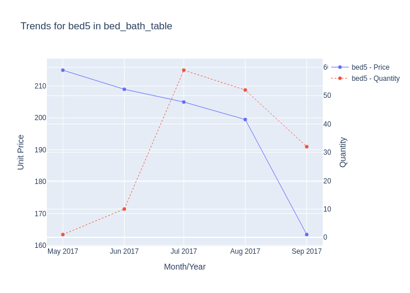
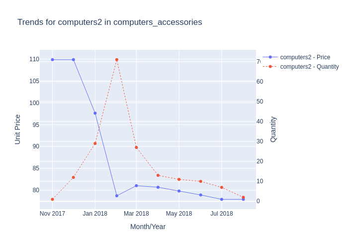
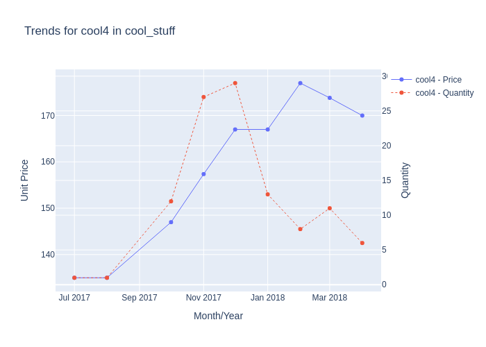
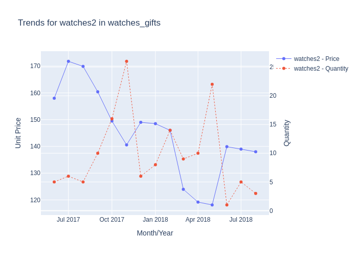

# PRICE OPTIMIZATION AND DEMAND FORECASTING FOR PROFITABILITY IN RETAIL

## About the Dataset

### **Context**  
Price optimization involves analyzing historical data to determine the most appropriate pricing for a product or service, ultimately maximizing a company’s profitability. Several factors influence efficient pricing, including:  
- **Demographics**: Understanding customer segments and their willingness to pay.  
- **Operating Costs**: Considering production, distribution, and overhead costs.  
- **Survey Data**: Incorporating customer feedback and competitive benchmarks.  
- **Business and Product Nature**: Tailoring strategies based on the type of business and the value offered by the product.  

Businesses frequently enhance their products by adding or upgrading features, which incurs costs in terms of effort, time, and, importantly, the company’s reputation. Therefore, determining the correct pricing is critical:  
- **Overpricing Risks**: Losing customers to competitors.  
- **Underpricing Risks**: Eroding revenue and diminishing perceived value.  

Price optimization helps businesses achieve an effective balance by aligning pricing strategies with profitability goals while delivering value to customers.

---

### **Content**  
The dataset contains information on **demand** and the corresponding **average unit price** at the **product and month-year level**.

---

### **Tasks**  
1. **Exploratory Data Analysis (EDA)**: Analyze patterns, trends, and key relationships within the data.  
2. **Data Visualization**: Create visual insights to understand demand dynamics and pricing impact.  
3. **Demand Forecasting**: Predict future demand based on historical trends.  
4. **Price Optimization**: Develop strategies to maximize revenue and profitability while ensuring customer satisfaction.

## Overview

This project is tailored for businesses operating in the retail and e-commerce industry, where effective pricing strategies are crucial for competitive advantage. In this industry, products are diverse, customer preferences are dynamic, and the competition is fierce. Companies must balance pricing, operational costs, and customer retention to maintain profitability and market relevance. The project's bjective is to analyze historical data to identify the most efficient pricing strategy for products that optimizes the company’s profitability. The goal is to strike the right balance between price, demand, and supply, considering internal costs, customer retention, and competition.

## EDA

#### Customers
   

#### Prices  

 

 

**For each product ID in each category**

**- Product Trend Plots**

**-  Click to View Product Trend Images**

  
Product Category: Bed Bath Table

  
Click below to view the trend images for Bed Bath Table products:

  
  
  
  
  

  
Product Category: Garden Tools

  
  
  
  
  
  
  
  
  
  

  
Product Category: Computers Accessories

  
  
  
  
  
  

  
Product Category: Health Beauty

  
  
  
  
  
  
  
  
  
  

  
Product Category: Cool Stuff

  
  
  
  
  

  
Product Category: Watches Gifts

  
  
  
  
  
  
  
  

  
Product Category: Furniture Decor

    
    
    
    

  
Product Category: Consoles Games

    
    

  
Product Category: Perfumery

    
    

#### Revenue 

 

#### Data decomposition: company vs. competitors

**Check the impact of competitor prices on the orders for the company**

**Analysis of Test Results**

**T-Tests**  
The T-tests assess whether there is a significant difference in the quantity ordered (qty) when the company's price is higher than that of its competitors.

- **Competitor 1**:  
  - **T-statistic**: -1.11  
  - **P-value**: 0.267  
  - **Interpretation**: There is no statistically significant difference in qty when prices are compared with Competitor 1, as the p-value > 0.05.

- **Competitor 2**:  
  - **T-statistic**: -0.16  
  - **P-value**: 0.870  
  - **Interpretation**: There is no statistically significant difference in qty when prices are compared with Competitor 2.

- **Competitor 3**:  
  - **T-statistic**: -0.14  
  - **P-value**: 0.887  
  - **Interpretation**: There is no statistically significant difference in qty when prices are compared with Competitor 3.

---

**Conclusion**  
The T-tests indicate that competitors' prices have no significant impact on the quantity ordered, as all p-values are greater than 0.05.

**Regression Results**

**Model Insights**  
The regression model evaluates the relationship between price differences and the quantity ordered.

- **Model Fit (R-squared)**:  
  - The R-squared value is **0.010**, indicating that only **1%** of the variability in the quantity ordered (qty) is explained by the price differences (`comp1_diff`, `comp2_diff`, `comp3_diff`).

- **Coefficients**:  
  - **comp1_diff**: Coefficient = -0.0112, p-value = 0.504 (**not significant**)  
  - **comp2_diff**: Coefficient = -0.0202, p-value = 0.164 (**not significant**)  
  - **comp3_diff**: Coefficient = 0.0110, p-value = 0.497 (**not significant**)  

None of the coefficients are statistically significant (p-value > 0.05), suggesting that differences in prices with competitors do not have a meaningful impact on the quantity ordered.

- **F-statistic and P-value**:  
  - **F-statistic** = 2.228, p-value = 0.0837  
  - The model is not statistically significant overall (p-value > 0.05).

---

**Conclusion**  
The regression analysis indicates that price differences between the company and its competitors do not significantly influence the quantity ordered. This suggests that other factors may play a more substantial role in driving customer demand.

**Overall Conclusion**  
The results suggest that competitor prices (`comp1_diff`, `comp2_diff`, `comp3_diff`) do not have a significant impact on the quantity ordered. Customers are likely influenced by other factors, such as:

- **Product Quality**: Features like product scores and customer satisfaction play a crucial role.  
- **Marketing and Brand Loyalty**: Repeat customers or effective promotional campaigns may drive demand.  
- **Seasonality**: External factors such as month, weekday, holiday, or weekend could significantly affect purchasing behavior.

These insights highlight the need to focus on these key areas to better understand and optimize customer demand.

**Insights**  
1. **Freight Price Impact (Competitor 1)**:  
   - The statistical test for `fp1_diff` suggests that freight price differences with Competitor 1 might influence the quantity ordered (`qty`).  
   - However, the regression model does not find a significant effect of any freight price differences, including `fp1_diff`, on `qty`.

2. **Freight Price Impact (Competitors 2 and 3)**:  
   - Freight price differences (`fp2_diff` and `fp3_diff`) with Competitors 2 and 3 show no significant influence on `qty` in both statistical tests and regression results.

3. **Model Explanatory Power**:  
   - The overall regression model has very low explanatory power, suggesting that factors other than freight price differences are driving changes in the quantity ordered.  

#### Analyze other features

**XGBoost models were used to determine which features influence the quantity of products ordered, as well as the revenue and profitability in the same order**

**With 9 Features:**
- **Customers** remains the most important feature, suggesting that the number of customers significantly impacts quantity ordered.
- **Product_photos_qty** and **product_weight_g** gain importance, indicating that more photos and heavier products might positively affect sales quantity.
- Features like **holiday** and **product_score** remain less impactful.

**With 5 Features:**
- **Volume** and **customers** dominate, indicating their importance in simpler models.

| **Metrics**                  | **5 Features**                                               | **9 Features**                                                                                          |
|------------------------------|-------------------------------------------------------------|--------------------------------------------------------------------------------------------------------|
| **Features Used**            | `'product_score', 'holiday', 'volume', 'customers', 'product_category_name'` | `'product_score', 'holiday', 'volume', 'customers', 'product_category_name', 'product_name_lenght', 'product_description_lenght', 'product_photos_qty', 'product_weight_g'` |
| **Mean Squared Error (MSE)** | **167.09**                                                  | **132.48**                                                                                             |
| **Top 2 Features by Importance** | **volume (38.2%)** & **customers (35.9%)**                     | **customers (33.1%)** & **product_photos_qty (16.4%)**                                                  |

The inclusion of additional features reduced MSE from 167.09 to 132.48, indicating that the additional features explain more variance in the target variable.

**Implications for Pricing Strategy**

**Incorporating Product Features:**
- **Product_photos_qty** and **product_weight_g** are significant in the 9-feature model, suggesting that customers are influenced by the quantity of product visuals and product weight. These factors can help justify higher pricing if communicated effectively in marketing.

**Core Drivers:**
- **Customers** and **volume** remain core predictors across models, reinforcing their critical role in forecasting demand and, consequently, profitability.

**Reduced Importance of Holiday:**
- The minimal impact of **holiday** across both models suggests that seasonal variations are not significant for this dataset.

**With prices**

**Features used:** `product_category_name`, `qty`, `freight_price`, `unit_price`, `product_name_lenght`, `product_description_lenght`, `product_photos_qty`, `product_weight_g`, `product_score`, `customers`, `volume`, `comp_1`, `ps1`, `fp1`, `comp_2`, `ps2`, `fp2`, `comp_3`, `ps3`, `fp3`, `lag_price`

**Mean Squared Error (MSE)** | **142.54**

**Top 2 Features by Importance** | **product_photos_qty (13.4%)** & **customers (24.5%)** 

Key factors driving sales volume are customer count, product photos, and freight price, while pricing and competitor data have a secondary influence. Focusing on product visibility and customer engagement could be more impactful than adjusting prices alone.

**Conclusion:**

The 9-feature model with customers, product photos, and product weight as key drivers of sales is the more effective model for predicting quantity ordered, achieving a lower MSE. While freight price is important, its inclusion in the more-feature model did not result in a performance improvement, indicating that the complexity introduced by adding price-related features may not necessarily lead to better predictions. This reinforces the notion that product characteristics and customer engagement are more influential in driving sales than pricing factors.
